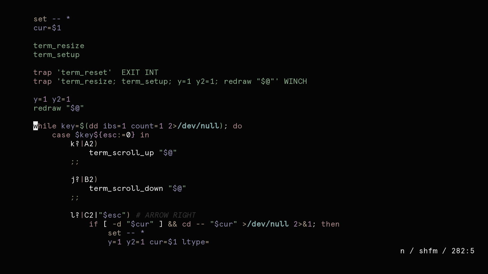
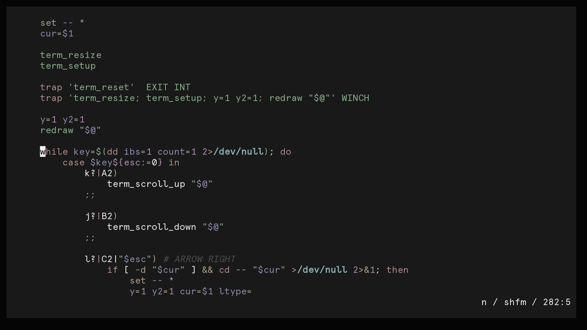
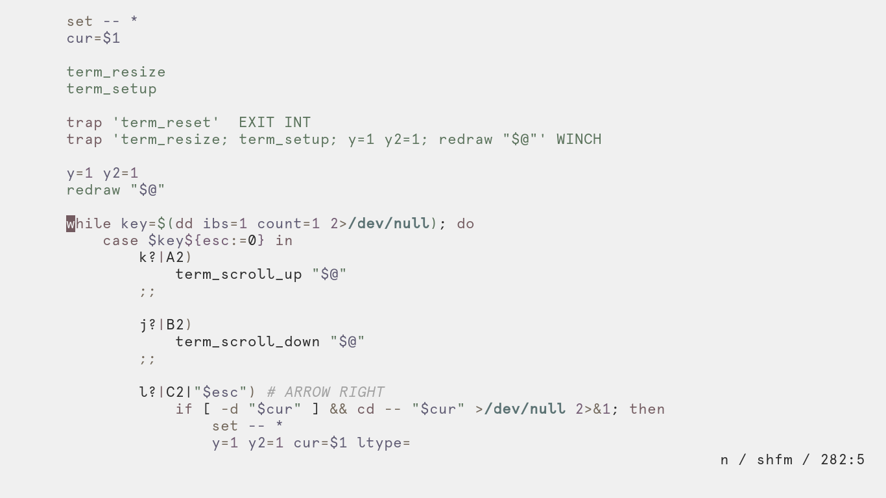
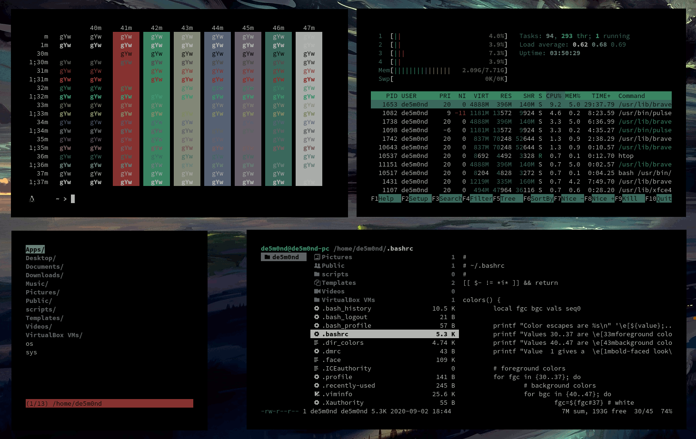

<h1 align="center">Mountaineer.vim</h1>

***

***

***

***

### Installation:
Simply move the variant you would like to use into your Vim/Neovim colorscheme folder, A [lightline.vim](https://github.com/itchyny/lightline.vim) colorscheme is also included.
